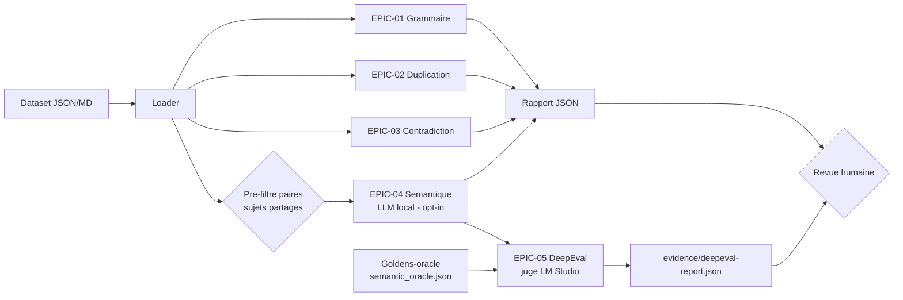

# Architecture — Audit Exigences

## Principe

L'outil charge un dataset d'exigences, execute des audits deterministes (sans IA ni reseau) et produit un rapport JSON de propositions. Un quatrieme audit **opt-in** (`--epic 4` / `--semantic`) ajoute une analyse semantique par LLM local (LM Studio). Aucune correction n'est appliquee automatiquement.

## Modules

| Module | EPIC | Methode | Sortie |
|---|---|---|---|
| `grammar.py` | 01 | Regles d'accord + ponctuation + capitalisation | `grammar`, `punctuation`, `capitalization` |
| `spelling.py` | 01 | Dictionnaire de fautes, position exacte | `spelling` avec suggestion |
| `duplicates.py` | 02 | Jaccard sur tokens normalises, seuil 0.85 | `duplicate` avec score |
| `contradictions.py` | 03 | Negations opposees + valeurs numeriques incompatibles | `negation_conflict`, `numeric_conflict` |
| `semantic.py` | 04 | Pre-filtre par sujets partages puis verdict JSON du LLM local | `semantic_contradiction`, `semantic_duplicate` |
| `llm_backends/` | 04 | `fake` (stub deterministe) ou `lmstudio` (OpenAI-compatible, stdlib urllib) | — |
| `tests/eval/` | 05 | DeepEval : `JsonCorrectnessMetric` + `GEval`, juge `LMStudioJudge` | `deepeval-report.json` |

## Frontieres de confiance

- Le mode par defaut (EPIC 1-3) reste sans appel reseau ni modele IA.
- L'audit semantique est **opt-in** et local uniquement : LM Studio sur `localhost:1234`, aucune cle API, aucune donnee envoyee a un service externe.
- Si le backend LLM est indisponible, l'audit sémantique est saute avec un message d'abstention ; le rapport reste produit.
- Le backend `fake` est un stub de test : il ne valide pas la qualite semantique reelle, qui releve de l'evaluation DeepEval (EPIC-05).
- Les scores de similarite et les verdicts LLM sont des propositions, pas des decisions de suppression.
- Les couples contradictoires restent a arbitrer par un humain.
- Le statut maximal d'un run est `ready-for-human-review`.

## Limites

- La duplication lexicale ne detecte pas les reformulations avec vocabulaire disjoint (couvert par l'audit semantique en opt-in).
- Les contradictions semantiques complexes hors des paires candidates pre-filtrees ne sont pas couvertes.
- Le dictionnaire de fautes est une liste figee, non exhaustive.
- Les verdicts LLM dependent du modele local charge ; la reproductibilite exige de figer `LMSTUDIO_MODEL`.
