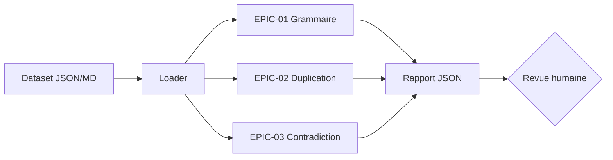

# Architecture — Audit Exigences

## Principe

L'outil charge un dataset d'exigences, execute des audits deterministes (sans IA ni reseau) et produit un rapport JSON de propositions. Aucune correction n'est appliquee automatiquement.

## Modules

| Module | EPIC | Methode | Sortie |
|---|---|---|---|
| `grammar.py` | 01 | Dictionnaire de fautes + regles de ponctuation | `spelling`, `punctuation`, `capitalization` |
| `duplicates.py` | 02 | Jaccard sur tokens normalises, seuil 0.85 | `duplicate` avec score |
| `contradictions.py` | 03 | Negations opposees + valeurs numeriques incompatibles | `negation_conflict`, `numeric_conflict` |

## Frontieres de confiance

- Aucun appel reseau, aucun secret, aucun modele IA dans ce lot.
- Les scores de similarite sont des propositions, pas des decisions de suppression.
- Les couples contradictoires restent a arbitrer par un humain.
- Le statut maximal d'un run est `ready-for-human-review`.

## Limites

- La duplication lexicale ne detecte pas les reformulations avec vocabulaire disjoint.
- Les contradictions semantiques complexes ne sont pas couvertes.
- Le dictionnaire de fautes est une liste figee, non exhaustive.
