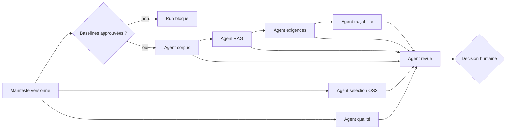

# Explication — Architecture du fil rouge automobile IA

## Principe

Le produit sépare les faits collectés, les propositions génératives et les décisions humaines. Le mode déterministe exerce les mêmes contrats que le fournisseur Mistral sans réseau, ce qui rend les tests indépendants d’un modèle et d’une clé API.

## Agents

| Agent | Entrée | Sortie | Autorité maximale |
|---|---|---|---|
| Corpus | Baselines et révisions | Inventaire et questions | `Observé` ou `Bloqué` |
| RAG | Objectif et passages | Citations classées ou abstention | `Observé` / `Non vérifié` |
| Exigences | Citations | Exigence sourcée | `Proposition` |
| Sélection OSS | Fiches candidates | Classement homogène | `Proposition` |
| Qualité | Diagnostics d’outils | Observations et conseils | `Observé`; aucun patch appliqué |
| Traçabilité | Liens explicites | Statut par lien | `Vérifié` seulement avec oracle et preuve déclarés |
| Revue | Résultats précédents | Proposition de Gate | Décision humaine obligatoire |

> **Limite de l’implémentation actuelle :** le libellé `Vérifié` de la traçabilité est seulement une déclaration fondée sur deux champs non vides. Le code ne contrôle ni l’artefact, ni sa vérité, ni une approbation humaine ; ce libellé ne doit pas être traité comme une preuve indépendante. Voir [`US-FIL-601`](../specs/epics/EPIC-FIL-06/user-stories/US-FIL-601.md).

## Frontières de confiance

Le fournisseur IA ne reçoit que la tâche et la charge utile de l’agent appelant. Le mode Mistral utilise `MISTRAL_API_KEY` depuis l’environnement, ne l’écrit jamais et demande un JSON à température nulle. La structure ne rend pas le contenu déterministe : toute sortie Mistral conserve le statut `Proposition`.

Le projet ne télécharge, n’exécute et ne modifie aucun dépôt tiers. Il ne modifie pas `upstream/**`. Les diagnostics qualité sont des entrées en lecture ; les conseils de correction ne sont jamais appliqués automatiquement.

## Choix issus de l’analyse des branches

- Contrats hors ligne et abstention inspirés des apports `test/programme` et `develop_Mo`.
- Gates humaines et agents spécialisés inspirés de `develop_florian`.
- Classement de candidats inspiré de `Romain`, sans faire du score une décision.
- Analyse qualité sans application automatique inspirée de `Damien` et `develop_celine`.
- Citations, reranking futur et évaluation à conserver depuis `Alain` et `exerciceMostapha`.
- Les résultats RAG en échec de `develop_eric` sont conservés comme signal qu’un index doit être évalué avant promotion.
