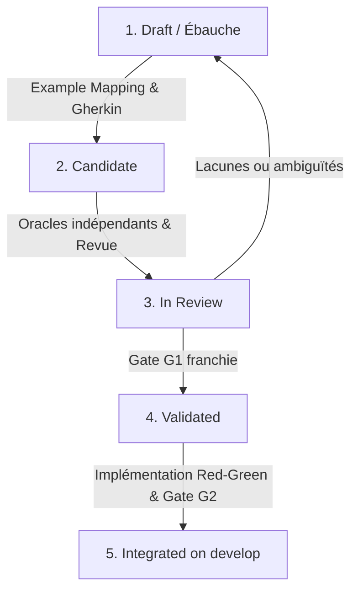

# Architecture de la documentation des spécifications

Ce dossier centralise l’architecture documentaire du portefeuille selon des principes d’ingénierie logicielle rigoureuse :
- cadrage, frontières de confiance, baselines figées et qualification des informations ;
- hiérarchie `Projet → Epic → User Story → Feature → Critère d’acceptation` ;
- audit d’exigences, Example Mapping, Gherkin, oracles indépendants et traçabilité ;
- enquête falsifiable, Red–Green–Refactor, mutation, revue humaine et documentation Doc-as-Code.

---

## 1. Organisation de l'arborescence

```text
FormationIaProject/
├── specs/
│   ├── README.md                      # Guide d'architecture et règles documentaires (ce fichier)
│   ├── ordre-et-etapes.md             # Référentiel des étapes à respecter dans l'ordre strict
│   ├── templates/                     # Modèles normalisés pour chaque type d'artefact
│   │   ├── template-project-spec.md   # Epic de projet et User Stories
│   │   ├── template-feature-spec.md   # Détail d’une feature reliée à une User Story
│   │   ├── template-example-mapping.md# Fiche d'atelier Example Mapping & table de décision
│   │   ├── template-matrice-tracabilite.md # Matrice v0 exigences ↔ doc ↔ code ↔ tests
│   │   ├── template-enquete-reproduction.md # Carnet d'enquête et fiche de reproduction de bug
│   │   ├── template-revue-qualite.md  # Rapport de revue assistée par IA et analyse statique
│   │   └── template-fact-check-doc.md # Matrice de vérification documentaire (affirmation → check)
│   ├── matrices/                      # Matrices de traçabilité v0 effectives des équipes
│   └── enquetes/                      # Carnets d'enquêtes et reproductions effectives
├── projets/                           # Spécifications de niveau macro par équipe / mission
│   ├── README.md                      # Index des projets et règles communes
│   ├── socle-commun/SPEC.md           # PROJ-SOCLE-001 (Intégration develop)
│   ├── normes/                        # PROJ-NORM-001 (Alain + Moustapha)
│   ├── qualite-code/                  # PROJ-QUAL-001 (Eric + Céline + Damien)
│   ├── logiciel-automobile-open-source/# PROJ-OSS-AUTO-001 (Sylvain + Nathalie + Romain)
│   └── ingenierie-exigences-agentique/# PROJ-REQ-AI-001 (Mohammed + Florient)
├── travail.md                         # Répartition opérationnelle des équipes et branches
└── template-feature-spec.md           # Raccourci vers specs/templates/template-feature-spec.md
```

---

## 2. Nomenclature et typologie des identifiants

Chaque document et chaque élément de spécification porte un identifiant unique et pérenne :

| Préfixe | Type de document / artefact | Exemple | Rôle |
|---|---|---|---|
| `PROJ-` | Spécification de projet / équipe | `PROJ-QUAL-001` | Cadrage du projet et portefeuille de Stories |
| `EPIC-` | Epic de projet | `EPIC-QUAL-001` | Résultat global et valeur recherchée |
| `US-` | User Story | `US-QUAL-003` | Besoin utilisateur vertical et vérifiable |
| `RM-` | Règle métier | `RM-QUAL-003` | Comportement singulier associé à une Story |
| `FEAT-` | Spécification de feature | `FEAT-QUAL-001` | Détail d’implémentation relié à une Story |
| `CA-` | Critère d'acceptation | `CA-QUAL-01` | Condition observable et vérifiable validant un comportement |
| `ENQ-` | Carnet d'enquête et reproduction | `ENQ-SEM-001` | Démarche falsifiable, preuve rouge et condition de reproduction |
| `TRAC-` | Matrice de traçabilité v0 | `TRAC-REQ-AI-001` | Chaîne de liens inspectables entre Stories, exigences, doc, code et tests |
| `REV-` | Rapport de revue et qualité | `REV-CPP-001` | Audit de règles, statique/dynamique et tri des faux positifs |
| `FACT-` | Matrice de fact-checking | `FACT-DOC-001` | Vérification des affirmations textuelles contre le code/tests |

---

## 3. Typologie des informations

Aucune affirmation ne doit être formulée sans que sa nature soit explicitement qualifiée :

1. **Proposition :** Énoncé généré par un modèle d'IA, une hypothèse de travail ou une suggestion. *N'a aucune valeur de preuve tant qu'elle n'est pas vérifiée.*
2. **Observation :** Constat direct et neutre relevé dans une source identifiée (fichier, commit, ligne de code, documentation officielle), sans inférence ni extrapolation.
3. **Preuve vérifiée :** Résultat d'une exécution contrôlée et reproductible (test unitaire passant, compilation réussie, hash vérifié, code retour documenté).
4. **Question ouverte / Inconnue :** Écart identifié, information manquante ou choix non tranché. *Les inconnues doivent rester visibles et ne jamais être comblées artificiellement par l'IA.*

---

## 4. Statuts formels d'une exigence ou d'un lien

| Statut | Signification | Transition autorisée vers |
|---|---|---|
| `Observé` | Mentionné textuellement dans une source identifiée mais relation non testée | `Candidat`, `Non vérifié` |
| `Candidat` | Proposition plausible issue d'une extraction ou d'une analyse, en attente de test | `Vérifié`, `Non vérifié`, `Bloqué` |
| `Vérifié` | Preuve formelle apportée (test exécuté avec succès, oracle indépendant validé) | Ne peut être rétrogradé que sur régression |
| `Non vérifié` | Donnée conservée pour traçabilité mais non démontrée | `Candidat`, `Bloqué` |
| `Bloqué` | Travail impossible sans accès, décision d'architecture ou dépendance manquante | `Candidat` après résolution du blocage |

> **Règle absolue :** Une proximité lexicale (mots clés similaires, nom de fonction approchant) ne constitue **JAMAIS** une relation de traçabilité.

---

## 5. Cycle de vie d'une spécification



1. **Draft :** Rédaction initiale du besoin, du périmètre et des questions ouvertes.
2. **Candidate :** Modèle complété avec critères d'acceptation observables, Example Mapping et scénarios Gherkin.
3. **In Review :** Relecture croisée par une autre équipe ou un reviewer. Vérification des oracles indépendants (non-tautologiques).
4. **Validated :** Spécification satisfaisant la Gate correspondante (G1 pour conception des tests, G2 pour preuves d'exécution).
5. **Integrated :** Fusionnée dans la branche `develop` après respect de tous les critères.

---

## 6. Références aux guides et templates

- [Points et étapes à respecter dans l'ordre strict](./ordre-et-etapes.md)
- [Template Project Spec — Epic et User Stories](./templates/template-project-spec.md)
- [Template Feature Spec](./templates/template-feature-spec.md)
- [Template Example Mapping](./templates/template-example-mapping.md)
- [Template Matrice de Traçabilité](./templates/template-matrice-tracabilite.md)
- [Template Enquête & Reproduction](./templates/template-enquete-reproduction.md)
- [Template Revue Qualité & Faux Positifs](./templates/template-revue-qualite.md)
- [Template Fact-Check Documentation](./templates/template-fact-check-doc.md)
