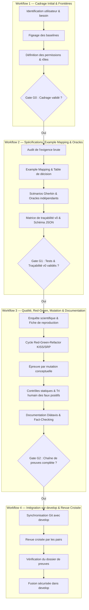

# Référentiel des Workflows Opérationnels

Ce dossier formalise les **quatre workflows d'ingénierie logicielle** du projet, articulés autour des jalons d'assurance qualité (**Gates G0, G1, G2**) et de l'intégration continue sur la branche `develop`.

---

## 1. Vue d'ensemble du cycle de développement

---

## 2. Index des workflows détaillés

| N° | Fichier de workflow | Objectif | Gate / Jalon | Rôles impliqués |
|:---:|---|---|:---:|---|
| **01** | [`workflow-01-cadrage-initial-G0.md`](workflow-01-cadrage-initial-G0.md) | Cadrer le besoin, borner les permissions, figer les baselines et isoler l'inconnu | **Gate G0** | Équipe, Responsable socle |
| **02** | [`workflow-02-spec-example-mapping-G1.md`](workflow-02-spec-example-mapping-G1.md) | Auditer les exigences, dériver les règles, scénarios Gherkin et matrice v0 en lecture seule | **Gate G1** | Équipe d'ingénierie, Relecteur |
| **03** | [`workflow-03-qualite-debugging-red-green-G2.md`](workflow-03-qualite-debugging-red-green-G2.md) | Reproduire le défaut, démontrer le patch minimal, muter, trier les alertes et fact-checker la doc | **Gate G2** | Équipe d'ingénierie, Responsable Qualité |
| **04** | [`workflow-04-integration-revue-croisee.md`](workflow-04-integration-revue-croisee.md) | Intégrer les incréments des branches de travail dans `develop` sans perte de traçabilité | **Intégration `develop`** | Relecteurs croisés, Intégrateur |

---

## 3. Matrice des compétences, outils et skills associés

| Étape de workflow | Outils CLI & Scripts | Skills Devin dédiés | Règles applicables |
|---|---|---|---|
| **WF 1 (Cadrage)** | `git`, `read`, inspection des sources | `/cadrage-g0` | Moindre privilège, baselines strictes |
| **WF 2 (Spécifications)** | `read`, `grep`, validation JSON | `/audit-exigence`, `/example-mapping`, `/matrice-tracabilite` | Oracles indépendants, anti-tautologie |
| **WF 3 (Preuves & Qualité)** | Cppcheck, CMake, Twister, Python, pytest | `/enquete-debug`, `/red-green-refactor`, `/test-mutation`, `/doc-fact-check` | KISS, YAGNI, SRP, Diátaxis |
| **WF 4 (Intégration)** | Git branch, git diff, PR review | `/gate-eval` | Zéro conflit, traçabilité intacte |

---

## 4. Règles communes d'exécution

1. **Aucun saut d'étape :** On ne commence jamais l'implémentation (WF 3) sans avoir validé la spécification et ses oracles indépendants (WF 2, Gate G1).
2. **Préservation des sources :** Le dossier `upstream/**` reste rigoureusement en lecture seule dans tous les workflows.
3. **Traçabilité des décisions :** Tout arbitrage, toute inconnue ou tout faux positif doit être consigné dans le document de spécification associé (`specs/`).
